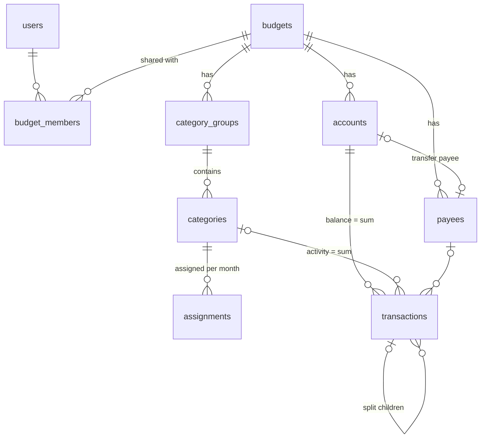

# lazybudget — Domain model

Status: **draft for review**. Everything marked `Decision:` is a proposal to accept or reject. Everything
marked `Open:` needs an answer before the related migration is written.

## 1. Purpose and scope

lazybudget is a zero-based ("envelope") budgeting system in the style of YNAB. It is multi-user in the
way a household needs: a budget is **shared** by its members, and every member can edit everything in it.
A user can be a member of several budgets. There are no fine-grained roles; the only distinction is
owner versus member, and it matters only for deleting the budget and managing membership.

- Every unit of money that exists in any account is either assigned to a category or sits in
  "Ready to Assign". Nothing is unaccounted for.
- Budgeting happens per month. Money assigned to a category in a month that is not spent stays in that
  category and rolls into the next month.
- Transactions record what actually happened to the accounts. The budget records what you intend.

Out of scope for v1: multiple currencies, fine-grained permissions (read-only members, per-account
access), bank sync, scheduled/recurring
transactions, savings goals/targets, reports beyond what the core numbers already give. The model should
not make these impossible, only unimplemented.

## 2. Principles

- **Money is an integer in minor units.** Every amount is a signed integer number of cents stored in a
  `bigint`. No floats, no decimals in the database. Formatting to `€ 12,34` is a presentation concern.
- **Signs are meaningful.** Outflows are negative, inflows are positive, everywhere. There is no separate
  `type` column for inflow/outflow; the sign is the type. This makes every balance a plain `SUM()`.
- **Months are first-of-month dates.** A budget month is stored as a `date` set to day 1
  (`2026-09-01`). Postgres can compare, sort and truncate dates natively; a `(year, month)` pair cannot.
- **Derived values are not stored** in v1. Balances, "available", and "Ready to Assign" are computed from
  transactions and assignments with queries. If it becomes slow, add caching later; never make the cache
  the source of truth.
- **The accounting identity must always hold** (see §5). Any operation that would break it is a bug.
- **Everything hangs off a `budget`; users reach a budget only through membership.** Every domain table
  carries a `budget_id`. Access is checked once, at the budget ("is this user a member?"), and everything
  below inherits it. No domain table references `users` directly.

`Decision:` single currency, EUR, stored implicitly (no currency column) in v1. A `currency` column on
`budgets` can be added later without touching amounts.

## 3. Entities

### 3.0 User and tenancy

`users` is Laravel's standard table (name, email, password, timestamps) plus whatever Sanctum needs for
API tokens. It is the authentication boundary, nothing more.

**budget_members** — the join between users and budgets.

| Field      | Type      | Notes             |
| ---------- | --------- | ----------------- |
| id         | bigint pk |                   |
| budget_id  | fk        |                   |
| user_id    | fk        |                   |
| role       | enum      | `owner`, `member` |
| created_at | timestamp | when they joined  |

Unique on `(budget_id, user_id)`. Exactly one row per budget has `role = owner`.

This is how YNAB works too ("YNAB Together"): one subscriber owns a plan and invites others by email;
everyone invited gets full edit access, and only the owner can delete the plan or manage who is in it.

Tenancy rules:

- A user is a member of zero or more budgets. Creating a budget makes the creator its owner.
- **Members and the owner have identical rights over the budget's content**: accounts, categories,
  assignments, transactions, payees. Only the owner may delete the budget, transfer ownership, or add and
  remove members.
- Every API request is authenticated as a user and addresses a budget, typically through the URL
  (`/api/v1/budgets/{budget}/accounts`). The application must verify that a `budget_members` row exists
  for (budget, auth user) on every such request, and must scope every query below the budget by
  `budget_id`. Never trust a bare `account_id` or `category_id` from the client without confirming it
  belongs to that budget.
- Adding a member in v1 is by the owner entering an existing user's email. Invitations to people without
  an account, with a token sent by email, are a later refinement.
- Cross-budget references are forbidden: a transaction's account, category and payee must all belong to
  the transaction's budget. Enforce in the application; consider composite foreign keys later.
- Uniqueness constraints (payee name, category name, assignment per month) are always per budget, never
  global.

`Decision:` membership is in v1 because a shared household budget is the primary use case. Roles stay at
two values. If read-only or restricted members are ever needed, `role` gains values and the authorization
checks grow; nothing below `budgets` changes.

`Decision:` no `user_id` on `budgets`. The owner is the member whose `role = owner`. One source of truth
for "who can see this budget" avoids the two drifting apart.

`Decision:` transactions record _which member_ entered them in a nullable `created_by_user_id` column.
It answers "who bought this?" in a household. It is the one place a domain table references `users`,
it is audit-only, and it is never used for authorization. Nullable so that deleting a user (or a future
import) does not have to touch transaction history.

### 3.1 Budget

The top-level container. Owns everything else. A user can have any number of budgets, for example the
shared household budget plus a personal sandbox for experimenting. Budgets are completely isolated:
no account, category, payee or transaction is ever visible from another budget, and there is no
cross-budget operation in v1 (copying categories from one budget to another is a possible later feature).
Deleting a budget deletes everything in it; only the owner may do that.

| Field                   | Type       | Notes                                                                  |
| ----------------------- | ---------- | ---------------------------------------------------------------------- |
| id                      | bigint pk  |                                                                        |
| name                    | string     | e.g. "Household"                                                       |
| first_month             | date       | the earliest month that can be budgeted; defaults to month of creation |
| created_at / updated_at | timestamps |                                                                        |

### 3.2 Account

Where money physically is.

| Field      | Type          | Notes                                              |
| ---------- | ------------- | -------------------------------------------------- |
| id         | bigint pk     |                                                    |
| budget_id  | fk            |                                                    |
| name       | string        | "ING", "Wallet", "Savings"                         |
| type       | enum          | `bank`, `cash`                                     |
| closed     | boolean       | closed accounts are hidden but their history stays |
| sort_order | integer       | for the UI                                         |

**Two types, no sub-types.** `bank` is any account at a bank you pay from with a card or transfer;
checking and savings are both just `bank`, distinguished by name. `cash` is physical money. The type
changes nothing in the math; it exists for the icon in the UI, and so that later types can be added
without a migration of meaning.

**Every account is on-budget.** All money in every account participates in the budget: it feeds Ready
to Assign and its outflows need a category. There is no "tracking" account in v1 (investments, mortgages,
things you only watch) and no credit card semantics. Both are listed in §9 as later additions, and the
model leaves room for them: tracking would be an `on_budget` boolean, credit cards a third `type` value.

`Decision:` types are `bank` and `cash` only, and there is no `on_budget` column yet. The household uses
debit cards and cash; modelling account kinds we do not have would be speculation.

**Balance** is derived: `SUM(transactions.amount) WHERE account_id = ?`. The **starting balance** is not a
column; it is an ordinary transaction dated the day the account was added (see §4.1).

**Checked transactions.** Periodically you compare the balance in the app with the balance in your bank
app or wallet. When they match, every transaction in the account that exists at that moment is marked
`checked = true` (§3.6). Anything entered afterwards, whether dated today or backdated, is unchecked.
The purpose is narrow and practical: when something does not add up later, only the unchecked rows need
inspecting.

**Checked balance** is the account balance restricted to checked rows. Immediately after a successful
comparison it equals the full balance; afterwards, the unchecked rows are exactly the difference.

`Decision:` a single boolean per transaction, not YNAB's cleared/uncleared/reconciled trio and not a
date-based checkpoint. A date cannot separate "compared this morning" from "entered this afternoon"
without storing a time, and we do not want times on transactions. A flag set at the moment of comparison
has no such ambiguity. Nothing is locked; checked rows stay editable.

### 3.3 Category group and Category

Categories are the envelopes. Groups only organise them visually.

**category_groups**

| Field         | Type    | Notes                          |
| ------------- | ------- | ------------------------------ |
| id, budget_id |         |                                |
| name          | string  | "Bills", "Everyday", "Savings" |
| sort_order    | integer |                                |
| hidden        | boolean |                                |

**categories**

| Field             | Type    | Notes                                                  |
| ----------------- | ------- | ------------------------------------------------------ |
| id, budget_id     |         |                                                        |
| category_group_id | fk      |                                                        |
| name              | string  | "Groceries"                                            |
| sort_order        | integer |                                                        |
| hidden            | boolean | hidden categories keep their history and their balance |
| kind              | enum    | `standard`, `inflow` — see below                       |

**The inflow category.** Each budget has exactly one system category with `kind = inflow`, conventionally
named "Ready to Assign". Income transactions are categorised to it. It cannot be assigned to, hidden,
or deleted. Its "available" number _is_ Ready to Assign (§5). Modelling RTA as a category rather than a
special case means every transaction has a category and every balance is the same query.

`Decision:` model the inflow bucket as a row in `categories` with a `kind` discriminator, rather than
as a nullable `category_id` meaning "income". Nullable foreign keys that mean something are a trap.

### 3.4 Monthly assignment

How much you decided to put into a category for a month.

**assignments**

| Field         | Type   | Notes                                                                 |
| ------------- | ------ | --------------------------------------------------------------------- |
| id, budget_id |        |                                                                       |
| category_id   | fk     | must be `kind = standard`                                             |
| month         | date   | first of month                                                        |
| amount        | bigint | cents, may be negative (moving money _out_ of a category back to RTA) |

Unique on `(category_id, month)`. Absence of a row means assigned 0. Assignments are the only thing in the
system that is purely a decision, not an event.

### 3.5 Payee

Who you paid or who paid you. Exists for autocomplete, "last category used", and reporting.

| Field               | Type        | Notes                                                     |
| ------------------- | ----------- | --------------------------------------------------------- |
| id, budget_id       |             |                                                           |
| name                | string      | unique per budget, case-insensitive                       |
| default_category_id | fk nullable | suggested category for new transactions                   |
| transfer_account_id | fk nullable | non-null marks this payee as "Transfer: <account>" (§3.7) |

### 3.6 Transaction

An event that changed an account's balance.

| Field                   | Type              | Notes                                                                               |
| ----------------------- | ----------------- | ----------------------------------------------------------------------------------- |
| id, budget_id           |                   |                                                                                     |
| account_id              | fk                |                                                                                     |
| date                    | date              |                                                                                     |
| amount                  | bigint            | signed cents; negative = money left the account                                     |
| payee_id                | fk nullable       | null allowed for e.g. bank fees, starting balance                                   |
| category_id             | fk nullable       | null **only** when the transaction is split (§3.8) or is a transfer (§3.7)          |
| memo                    | text nullable     |                                                                                     |
| transfer_transaction_id | fk nullable, self | the other half of a transfer (§3.7)                                                 |
| parent_transaction_id   | fk nullable, self | non-null on the children of a split (§3.8)                                          |
| checked                 | boolean           | default false; set true by a balance comparison (§3.2, §4.7)                        |
| created_by_user_id      | fk nullable       | the member who entered it; audit only (§3.0)                                        |

Rules:

- A transaction must have a category, unless it is a split parent (children carry the categories) or
  a transfer (money moved between two of your accounts never leaves the budget, so it is not spending).
- `date` is a calendar date, no time. It decides which budget month the transaction counts toward.

### 3.7 Transfer

Money moving between two of your own accounts. Modelled as **two transactions**, one per account, with
opposite amounts, linked through `transfer_transaction_id` in both directions. The payee on each side is
the system payee for the other account (`payees.transfer_account_id`). Neither side has a category:
the money did not leave the budget, so no envelope changes. Withdrawing € 100 at an ATM is a transfer
`bank → cash`, not spending; the spending happens when the cash is used.

`Decision:` two linked rows rather than one row with `from_account`/`to_account`. Every account balance
stays `SUM(amount)` over its own rows, and each half is checked independently with its own account.
The application layer must create/update/delete both halves atomically.

### 3.8 Split transaction

One purchase, several categories (a supermarket receipt with groceries and household items).

- The **parent** row holds `account_id`, `date`, `payee_id`, `amount` (the total), `checked`, and
  `category_id = null`.
- Each **child** row has `parent_transaction_id` set, its own `category_id`, `memo`, and `amount`, plus
  a copy of the parent's `account_id` and `date` (see the decision below). Payee and checked state are
  the parent's and are not stored on children.
- Invariant: `SUM(children.amount) = parent.amount`.

Rules (these match how YNAB behaves):

- **No nesting.** A child cannot itself be a split; `parent_transaction_id` chains are exactly one level
  deep. A split needs at least two children, otherwise it is a plain transaction.
- **A child may be a transfer.** Paying a shared bill by card and recording a friend's share as a
  transfer into an "Owed to me" account is one split with a transfer child. The child carries
  `transfer_transaction_id`; the other half, on the other account, is an ordinary top-level row, never a
  child. Transfer children have `category_id = null` like any transfer, so "leaf rows with a category"
  still describes exactly the rows that carry category meaning.
- **Children are validated and replaced as a whole.** The API accepts a split as a parent plus a full
  list of children and rejects it if the amounts do not sum to the parent's total; it never auto-adjusts
  a child to make the numbers fit. Updating a split replaces the whole children list. If the new list has
  one entry, the split collapses into a plain transaction with that entry's category and memo.

Account balance sums **parents only** (children have `parent_transaction_id IS NOT NULL` and are
excluded). Category activity sums **children and non-split parents**. Concretely, the set of rows that
carry category meaning is `WHERE category_id IS NOT NULL`, which is exactly the leaves.

`Decision:` **children duplicate `date` and `account_id` from the parent.** Every row with a category
then also has a date and an account, so the category activity query in §5 is a plain
`WHERE category_id = ? AND date BETWEEN ? AND ?` with no self-join, and an index on
`(category_id, date)` serves it directly. The write path for splits is a single place (children are
replaced as a whole, above), which keeps the copies in sync inside one database transaction. A test
asserts that every child matches its parent's `date` and `account_id`; the accounting identity test
would also expose any drift. Consequence for the migration: `date` and `account_id` are `NOT NULL` on
all rows, children included.

## 4. Lifecycle events

### 4.1 Adding an account

Creates the `accounts` row and one transaction: the starting balance, dated the given date, payee null,
memo "Starting balance", category = the inflow category. This money becomes Ready to Assign. A negative
starting balance (an overdrawn account) _reduces_ Ready to Assign, which is honest: that money is already
spent.

### 4.2 Assigning money

Upsert an `assignments` row. Assigning more than is in Ready to Assign is allowed but makes RTA negative,
which the UI shows in red. The model does not prevent it; the identity still holds.

### 4.3 Recording spending

Insert a transaction with negative amount and a category. That category's activity for the month drops;
the account balance drops; nothing else changes.

### 4.4 Recording income

Insert a transaction with positive amount and the inflow category. Ready to Assign rises.

`Decision:` income counts toward the month it is _dated_. YNAB's old "income for next month" toggle is
not modelled; if you get paid on the 28th for next month, you simply assign it to next month's columns.

### 4.5 Moving money between accounts

A transfer (§3.7): withdrawing cash, topping up a savings account, paying back a family member's account.
Two linked transactions, no category, no envelope changes. Total money in the budget is unchanged, so
Ready to Assign is unchanged.

### 4.6 Moving money between categories

Not a transaction. Two assignment changes in the same month: −X on the source, +X on the target.
The UI presents this as one "move" action.

### 4.7 Checking an account balance

The user enters the balance shown by the bank (or counts the cash). The app compares it with
`balance(a)` over transactions dated today or earlier.

- If equal: set `checked = true` on every transaction of the account dated today or earlier. Done.
- If not equal: show the difference and the unchecked transactions so the user can find the missing or
  wrong entry. If they cannot, they may accept an adjustment transaction (payee null, memo "Balance
  adjustment", category = inflow category) for the difference, after which everything is marked checked.

The flag is informational. It never prevents editing. The UI distinguishes checked from unchecked rows
visually and offers a filter for unchecked only. Editing or deleting a checked row is allowed; the row
keeps its flag, since the user is presumed to know what they are doing.

`Decision:` future-dated transactions are excluded from the mark-all step. A row dated after today
cannot have been compared with anything, so it stays unchecked. The balance the app compares against the
bank is therefore also `balance(a)` restricted to `date <= today`; the identity in §5 is unaffected
because it is evaluated per month, not per day.

### 4.8 Deleting things

- Transactions: hard delete, both halves of a transfer, all children of a split.
- Accounts: only if they have no transactions; otherwise **close** them.
- Categories: only if they have no transactions and no assignments; otherwise **hide** them.
  `Open:` YNAB lets you delete a category and reassign its history to another. Worth it in v1? Proposal: no.
- Payees: allowed; transactions keep a null payee. Merge payees is a v2 feature.

## 5. Derived values

All amounts in cents. `M` is a month (first-of-month date), `end(M)` is its last day.

**Account balance**

```
balance(a)          = SUM(t.amount)  WHERE t.account_id = a AND t.parent_transaction_id IS NULL
checked_balance(a)  = same, AND t.checked = true
unchecked_total(a)  = balance(a) - checked_balance(a)
```

**Category activity in a month** (leaf rows only)

```
activity(c, M) = SUM(t.amount)
                 WHERE t.category_id = c
                   AND t.date BETWEEN M AND end(M)
```

**Category assigned in a month**

```
assigned(c, M) = COALESCE(assignments.amount, 0) WHERE category_id = c AND month = M
```

**Category available at end of month** (the envelope's balance; carries over)

```
available(c, M) = SUM over all months m <= M of ( assigned(c, m) + activity(c, m) )
```

`Decision:` a negative available carries forward unchanged into the next month. The envelope stays
red until you assign money to cover it. (YNAB instead zeroes overspent categories at month end and
subtracts the overspend from next month's RTA. Both satisfy the identity; carry-forward is simpler to
compute, to explain, and to display. Revisit if it turns out to be annoying in practice.)

**Ready to Assign at end of month**

```
rta(M) = available(inflow_category, M)  computed with the same formula, where
         activity(inflow, m) = all inflow-categorised transactions in m   (income, starting balances)
         assigned(inflow, m) = - SUM(assigned(c, m)) over all standard categories c
```

In words: everything that ever entered the budget, minus everything ever assigned, up to and including M.
Assignments in months _after_ M do not reduce rta(M); the UI shows them separately as "assigned in
future".

**The accounting identity** (must hold for every M)

```
SUM over all accounts a of balance(a) as of end(M)
  == rta(M) + SUM over standard categories c of available(c, M)
```

Every cent in every account is either in an envelope or waiting to be. A test that asserts this after
every scenario in §6 is the single most valuable test in the codebase. Transfers keep both sides equal
by construction: the two halves cancel on the left and touch nothing on the right.

## 6. Scenarios the model must survive

Each is a candidate feature test. Balances in €, stored in cents.

1. **Fresh start.** Add "ING" (bank) with +1 500 starting balance → rta = 1 500, all categories 0. Identity: 1 500 = 1 500 + 0.
2. **Budget the month.** Assign 400 groceries, 900 rent, 200 fun → rta = 0, available = 400/900/200.
3. **Spend by card.** −85,20 groceries from ING → ING 1 414,80; groceries available 314,80; rta 0. Identity: 1 414,80 = 0 + 314,80 + 900 + 200.
4. **Withdraw cash.** Add "Wallet" (cash, starting 0). Transfer 100 ING → Wallet → ING 1 314,80, Wallet 100. No category changes. Identity: 1 314,80 + 100 = 0 + 314,80 + 900 + 200.
5. **Spend cash.** −60 fun from Wallet → Wallet 40, fun 140. Identity: 1 314,80 + 40 = 0 + 314,80 + 900 + 140.
6. **Overspend.** −500 fun from ING → fun available −360. Identity still holds (the negative envelope offsets). Next month fun starts at −360 until covered.
7. **Split receipt.** −50 at "Albert Heijn": children −40 groceries, −10 household. Account balance moves by 50 once; each category by its child amount.
8. **Move money.** Groceries −100, fun +100 in the same month's assignments → rta unchanged.
9. **Income mid-month.** +2 000 salary, inflow category → rta 2 000 (if all earlier money was assigned).
10. **Overdrawn start.** Add a second bank account with starting balance −200 → rta drops by 200. Identity holds because the negative balance is on the left and the reduced rta on the right.
11. **Balance check.** Bank says ING is 1 054,80 and the app says 1 054,80 → all rows in ING become checked; checked_balance = balance. Later that day a −20 transaction is entered → it is unchecked, unchecked_total = −20, and it is the only row shown in the "unchecked" filter.
    Variant: bank says 1 054,80, app says 1 054,30 → the user accepts an adjustment +0,50 to the inflow category, then everything is marked checked. rta rises by 0,50; identity holds.
12. **Month rollover.** Nothing happens at month end. `available(c, next month)` simply includes one more month of assigned and activity (which are both 0 until you act). There is no job to run.

## 7. Entity relationship overview



## 8. Open decisions, collected

1. ~~Denormalise `date` and `account_id` onto split children?~~ **Decided: yes** (§3.8).
2. Allow deleting a category with history by reassigning it? (§4.8) — proposal: no in v1.
3. Overspending: carry forward (proposed) or YNAB-style reset? (§5)
4. Should `payees.name` uniqueness be case-insensitive (`citext` or a lower-cased index)? — proposal: yes, lower-cased unique index.
5. Do we want soft deletes anywhere? — proposal: no; closed/hidden flags cover the real need, hard delete elsewhere.
6. ~~Reconciled-lock in database or application?~~ **Moot**: the `checked` flag never locks anything (§4.7).
8. ~~Exclude future-dated transactions when marking an account checked?~~ **Decided: yes** (§4.7).
7. ~~Record which member created a transaction?~~ **Decided: yes**, `created_by_user_id`, audit only (§3.0).

## 9. What comes after v1 (kept possible, not built)

- Credit cards: a third account `type`. The math already works (spending on the card reduces the
  envelope, paying the card is a transfer, pre-existing debt is a negative starting balance); what would be
  added is a derived "reserved for card payment" number, equal to the card's negative balance, so the cash
  in the bank account is not mistaken for assignable money. YNAB's automatic "Credit Card Payment"
  category is a heavier alternative; not needed for the identity to hold.
- Tracking accounts (investments, mortgage): an `on_budget` boolean on `accounts`. Tracking accounts sit
  outside the identity; a transfer to one becomes spending and needs a category on the on-budget side.
- Scheduled/recurring transactions: a `scheduled_transactions` table that _generates_ rows in `transactions`.
- Targets/goals: a `targets` table per category, purely informational, never changes the math.
- Finer roles: more values in `budget_members.role` (e.g. `viewer`) and matching authorization checks.
- Email invitations for people who do not have an account yet.
- Budget templates / "copy categories from another budget" for starting a new one quickly.
- Multi-currency: `currency` on `budgets`, and eventually on `accounts` with an exchange-rate table.
- Bank import: a `transaction_imports` staging table with matching against existing rows.
- Reports: all derivable from the queries in §5, grouped by month/category/payee.
